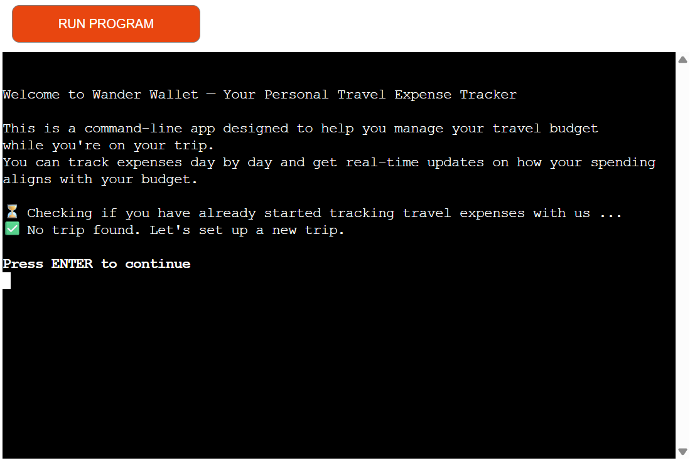
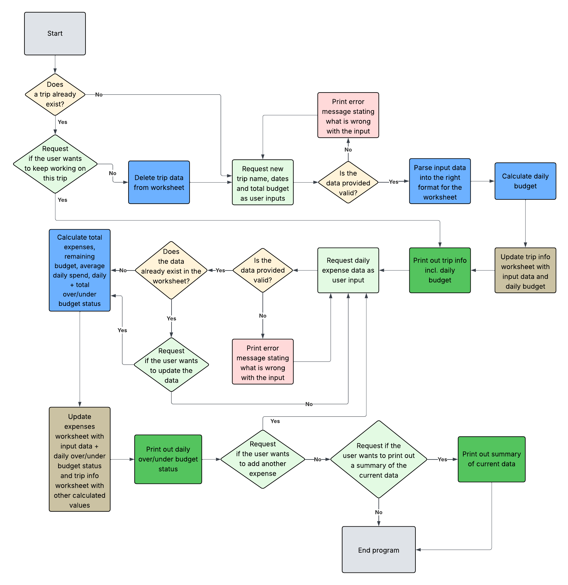
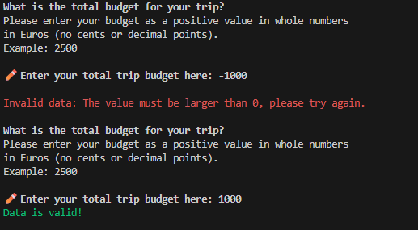
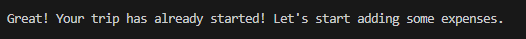
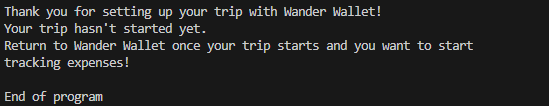
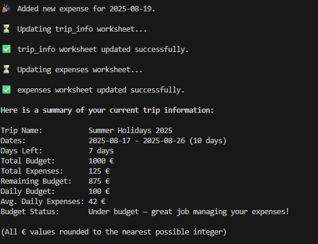

# Wander Wallet

“Wander Wallet” is a Python-based command-line application designed to help travelers track expenses and stay within budget while being on a trip. It is designed to give travelers a clear overview of their budget, tracked expenses and remaining funds while travelling. The application uses the Google Cloud API to connect to Google Sheets to store and update trip information and expenses. As a user, I want to easily add new expenses, view my current financial status and stay on track with my travel budget.

The website was created for educational purposes only.

[Live page on Heroku](https://wander-wallet-c4d586c6e78d.herokuapp.com/)




[](https://wander-wallet-c4d586c6e78d.herokuapp.com)


- - -

## User Experience (UX)

### Site Goals

- Business Goals: Provide a simple and reliable tool for managing travel budgets directly from the command line

- Users’ needs: Easily track trip expenses, stay on top of budgets and quickly understand whether they are spending within their limits

- Primary user: Travelers who want a simple way to manage their trip finances

### User Stories

#### Must-have

1. As a user, I want to easily understand the main purpose of the app,
so I know right away how it helps me.

2. As a user, I want to be able to create a new trip with a budget and dates,
so I can set the financial framework for my travels.

3. As a user, I want to see a clear summary of my trip, including budget, expenses and whether I am over, under or on budget,
so I always know my financial status.

4. As a user, I want to add new expenses with a date and amount,
so I can keep an accurate record of my spending.

5. As a user, I want to update an expense if I entered something incorrectly,
so my data stays accurate.

6. As a user, I want my data to be saved so that I can continue tracking expenses until the end of my trip,
so I don’t lose progress during the journey.

#### Should-have

7. As a user, I want feedback after adding or updating an expense,
so I know my action was successful.

8. As a user, I want the app to handle errors gracefully so it doesn’t crash unexpectedly,
so I can keep using it without interruptions.

#### Could-have

9. As a user, I want to categorize expenses (e.g. food, transport, accommodation),
so I can see where my money goes.

10. As a user, I want to see charts of my spending for better insights,
so I can quickly spot patterns.

### Features to achieve the goals

- The application will have a simple, clear command-line interface so users immediately understand its purpose

- Users will be able to create a new trip by entering a trip name, budget and start/end dates

- Users will be able to add new expenses for specified dates

- Users will be able to update/correct an existing expense for a specific date

- Users will be able to view a clear summary of their trip, showing total budget, spent amount, remaining funds and whether they are over, under or on budget

- Users will be able to see a list of expenses

- The application will provide immediate feedback after adding or updating an expense to confirm the action succeeded

- Trip and expense data will be stored in Google Sheets to ensure persistence and accessibility across devices

- The app will handle errors gracefully to prevent crashes (e.g., invalid input)

- Expenses can be categorized for better tracking and reporting (could-have)

- Users will be able to view charts or visual summaries of spending by category or over time (could-have)

- - -

## Design

### Flowchart

The following flowchart was created using [Lucidchart](https://lucid.app/) before starting to code, to visualize the intended general workflow of the application. During the development process, the workflow was adapted in certain areas to better fit technical requirements and improve user experience. While the flowchart represents the initial plan, some steps were modified or added in the final implementation.



### Color Scheme/Imagery/Typography
The application uses the [Python Essentials Template](https://github.com/Code-Institute-Org/python-essentials-template) provided by Code Institute. Although the application has a simple terminal-based interface with limited UI design, the following style choices were made to make user inputs, feedback, and overall interaction clear and easy to follow.

Bold text is used to highlight anything directly concerning the user, such as their inputs or headings in summaries. Green text is used to signal valid user inputs, while red text indicates errors, invalid inputs or warnings. All text styling has been implemented using [colorama](https://pypi.org/project/colorama/).

Emojis are used to indicate status messages and user inputs, helping to make the interface more engaging and easier to follow.

### Features

The application fulfills the must-have and should-have user stories.

#### Start Screen

When the application is launched, it displays a welcome message that introduces Wander Wallet and briefly explains its purpose. Immediately after, the app checks the database to see whether the user has already set up a trip.

If a trip exists, the user is shown a summary of their current trip, including budget, expenses and remaining funds.


If no trip is found, the user is informed about this and will be prompted to create a new trip in the next step.


#### Setting up a new trip

If no active trip is found, the user is guided through creating one. The setup process requires the user to provide a trip name, start and end dates and a total budget. Each input field includes specific restrictions to ensure valid data.

Trip Name:

- Trip name cannot be empty
- Can only contain letters (A–Z), numbers (0–9) and spaces
- 1-30 characters


Trip Dates: 

- Dates must be entered in the correct format and are validated to ensure they represent real calendar dates

- End date must lie in the future, preventing users from creating trips that have already ended


Trip Budget: 

- Budget must be entered in whole numbers and be a positive value


If the user enters invalid input, the app displays an error message explaining what went wrong and then shows the input field again, allowing the user to correct their input before proceeding. This ensures that every new trip is set up with complete and valid information before tracking begins.

Here is an example of an error message for a negative budget input.



When all trip information has been provided successfully, additional data such as the average daily budget is automatically calculated. The trip information is then saved to the connected Google Sheets worksheet and the user receives a status message confirming that the setup was successful. Finally, a summary of the current trip is displayed, giving the user a clear starting point for tracking their expenses.


After that, the user can either start adding expenses to their trip, or the program will end if the trip has not started yet. This prevents adding expenses that have not occurred yet. In this case, the user is informed that they can return to the app once the trip begins.

Trip has already started:


Trip has not started yet:


#### Working with an already existing trip

When, upon starting the app, a trip already exists in the database, the user is first shown a summary of their current trip, like described under [Start Screen](#start-screen).

Then the user can choose to show a list of all currently tracked expenses, by submitting a "yes" or "no" into the following input field.


After that, or when choosing "no" in the previous question, the user is asked if they want to continue working with this trip. 

If "yes", it is checked if the trip has already started or not, like after setting up a new trip. After that the user will be able to add expenses.


If "no", the current trip will be deleted and the process continues with setting up a new trip, like described above.


#### Adding expenses

After setting up a new trip or choosing to continue with the current one, the user is prompted to add a new expense. An expense consists of a date and an amount, each with specific restrictions to ensure valid data.

First the user is asked to enter an expense date:

- The date must be entered in the correct format and is validated to ensure it represents a real calendar date

- The date must fall within the travel period

- Future dates are not allowed, since expenses can only be recorded once they have occurred


Next, the user is asked to enter an expense amount:

- The amount must be entered in whole numbers and be a positive value


If the user enters invalid input for either field, the app displays an error message explaining what went wrong and then shows the input field again, allowing the user to correct their entry.

Example error message for invalid date input:


When both fields are entered successfully, the expense is saved to the connected Google Sheets worksheet. The user receives a status message confirming that the new expense has been added. Afterwards, the updated trip summary is shown.



#### Adding Multiple Expenses
After an expense has been successfully recorded, the user is asked whether they would like to add another one.

If the user chooses "yes", the process of entering a new expense (date and amount) begins again.


If the user chooses "no", the app proceeds by asking if the user wants to see a list of all tracked expenses.


This loop allows users to quickly add multiple expenses in one session, while also giving them the option to review their complete list of expenses before returning to the main summary.

#### Updating an Existing Expense

The user is also able to update an expense after it has already been submitted. For example, they may notice when reviewing the expense list at the beginning of the program that an amount was entered incorrectly, or that the cost for a specific date has changed.

In this case, the user can simply enter the same date again when prompted to add a new expense. The program automatically detects that an expense for this date already exists and notifies the user.

If the user chooses yes, they can enter a new amount, which will replace the previous one.


If the user chooses no, the app shows the current trip summary again, then continues to the next step and asks whether they want to add another expense.


This approach makes updating expenses a natural part of the normal expense entry flow.

#### End of the Program

Once the user decides not to add another expense, they are asked whether they would like to see the list of current expenses again.

If the user chooses yes, the full list of expenses is displayed before the program ends.


If the user chooses no, the program ends immediately.

When the program ends, the user is thanked for using Wander Wallet. A final summary of the trip is displayed, showing the budget, total expenses, remaining funds and whether the user is currently under or over budget.

Finally, the user is reminded that they can return to the app at any time to add more expenses to their trip or set up a new one.


#### Error Handling
Like mentioned above, all user inputs are validated, and clear messages are provided to inform the user about the expected format and type of input.

All input validation functions are organized in a dedicated validation.py file. There are four specific validation methods:

1. Expense date: Ensures the date is in the correct format, within the trip period and not in the future

2. Yes/No inputs: Checks whether the user correctly typed the words "yes" or "no" 

3. Integer inputs: Checks that numerical values are positive and valid

4. New trip information: Validates the trip name, dates and total budget according to the required restrictions

Additionally, a general error handling mechanism is implemented by wrapping the main function in a `try`/`except` block to catch any unexpected errors. Examples of such errors include connection issues with Google Sheets or file read/write problems. If such an error occurs, the application will restart automatically with the latest version of data that was successfully added to the database.


### Future Features

So far, the application includes all necessary features to create a minimum viable product. However, there is room for improvement and further functionality to enhance usability and flexibility for travelers:

- *Expense categories*  
Add the option to assign categories such as food, transport, or accommodation to expenses, making it easier to analyze spending patterns.

- *Spending charts and visual insights*  
Provide visualizations (e.g. bar charts, line charts) to give users a clearer understanding of their budget usage and spending behavior.

- *Main menu navigation*  
Instead of being guided strictly through the workflow, offer a menu at the start of the program where the user can choose what they want to do (e.g. set up a new trip, add expenses, view expenses, update expenses or see a summary).

- *User accounts and login system*  
Implement a simple authentication system so multiple users can store and access their own trips independently. This would allow different travelers to use the app at the same time without interfering with each other’s data.

These features would significantly improve the overall user experience and make the application more powerful in supporting effective budget tracking.

## Testing

> NOTE: For all testing, please refer to the [TESTING.md](TESTING.md) file.

- - -

## Technologies Used

### Languages Used

Python was used to create this application. 

All other code inside this project has been provided by the [Python Essentials Template](https://github.com/Code-Institute-Org/python-essentials-template) by Code Institute.

### Frameworks, Libraries & Programs Used

[Lucidchart](https://lucid.app/) - Used to create the flowchart

[Shields.io](https://shields.io/) - To add badges to the README

Chat GPT - Help debug, troubleshoot and explain things

Git - For version control

Github - To save and store the files for the website

Visual Studio Code - For local development

Google Cloud API - For access to Google services used by the app

- Google Sheets API - Handles all reading and writing of trip data and expenses to a connected Google Sheets document. This serves as the main database for the application

- Google Drive API - Manages access permissions and enables the application to locate and update the correct worksheet

Python libraries:
- colorama - To style the output displayed in the console
- datetime - To handle the "date" user inputs
- re - To handle trip name input
- time - To pause execution of code
- gspread - Access and update data in the Google Sheets spreadsheet
- google-auth - Set up the authentication needed to access the Google Cloud project

- - -

## Data Model

#### Classes & Functions

The program uses two classes as a blueprint for the project's object-oriented programming (OOP). This allows for the objects to be reusable and callable where necessary.

```python
class Trip:
    """
    Trip class
    """
    def __init__(self, trip_info: dict, expenses: dict):
        self.trip_info = trip_info
        self.expenses = expenses
        # Get trip info input fields (for calculations)
        self.trip_name = trip_info["trip_name"]
        self.start_date = datetime.strptime(
            trip_info["start_date"], "%Y-%m-%d"
            ).date()
        self.end_date = datetime.strptime(
            trip_info["end_date"], "%Y-%m-%d"
            ).date()
        self.total_budget = int(trip_info["total_budget"])
```
The `Trip` class is the core data model of the app, designed to store trip details and expenses while automatically calculating useful statistics like duration, daily budget, spending status and remaining balance. It also includes one of the main functions of the app that shows the trip summary to the user.

```python
class SheetManager:
    """
    Sheet Manager class
    """
    def __init__(self, creds_file: str, sheet_name: str):
        SCOPE = [
            "https://www.googleapis.com/auth/spreadsheets",
            "https://www.googleapis.com/auth/drive.file",
            "https://www.googleapis.com/auth/drive"
            ]
        CREDS = Credentials.from_service_account_file(creds_file)
        SCOPED_CREDS = CREDS.with_scopes(SCOPE)
        self.client = gspread.authorize(SCOPED_CREDS)
        self.sheet = self.client.open(sheet_name)
```
The `SheetManager` class handles all interactions with Google Sheets, making it easy to read, update and clear trip data from the connected spreadsheet. It separates storage logic from the main application, so the app can focus on budgeting features while this class reliably manages data access in the background.

The primary functions used on this application are:

- Validation functions in `validation.py`
    - Check validaity of all user inputs. See [Error Handling](#error-handling) for more details.
- `trip_exists()`
    - Check if trip exists already
- `get_new_trip_info()`
    - Get info for a new trip (start, end dates, trip name, budget)
- `continue_trip()`
    - Get input if the user wants to continue with the current trip or start a new one
- `start_new_trip()`
    - Initialize new trip
- `add_expenses()`
    - Get new expense entry as user input
- `get_new_expense()`
    -  Loop to handle asking the user to add another expense
- `show_expenses_summary()`
    - Check if user wants to see a list of all currently tracked expenses
- `main()`
    - Run all program functions.

#### Google Sheets

The application uses a Google Spreadsheet with two worksheets to store all trip-related data:

- `trip_info`: Stores the main trip details (trip name, dates and total budget) together with calculated values such as duration, days left, remaining budget and budget status.

- `expenses`: Stores all user-entered expenses with two columns: date and amount. 

Together, these worksheets ensure that both user input and automatically calculated data are saved, persistent and always up to date.
- - -

## Deployment & Local Development

### Deployment

Code Institute has provided a [template](https://github.com/Code-Institute-Org/python-essentials-template) to display the terminal view of this backend application in a modern web browser. This is to improve the accessibility of the project to others.

The live deployed application can be found deployed on [Heroku](https://wander-wallet-c4d586c6e78d.herokuapp.com).

### Heroku Deployment

This project uses [Heroku](https://www.heroku.com), a platform as a service (PaaS) that enables developers to build, run, and operate applications entirely in the cloud.

Deployment steps are as follows, after account setup:

- Select **New** in the top-right corner of your Heroku Dashboard, and select **Create new app** from the dropdown menu.
- Your app name must be unique, and then choose a region closest to you (EU or USA), then finally, click **Create App**.
- From the new app **Settings**, click **Reveal Config Vars**, and set the value of **KEY** to `PORT`, and the **VALUE** to `8000` then select **ADD**.
- If using any confidential credentials, such as **CREDS.JSON**, then these should be pasted in the Config Variables as well.
- Further down, to support dependencies, select **Add Buildpack**.
- The order of the buildpacks is important; select `Python` first, then `Node.js` second. (if they are not in this order, you can drag them to rearrange them)

Heroku needs some additional files in order to deploy properly.

- [requirements.txt](requirements.txt)
- [Procfile](Procfile)
- [.python-version](.python-version)

You can install this project's **[requirements.txt](requirements.txt)** (*where applicable*) using:

- `pip3 install -r requirements.txt`

If you have your own packages that have been installed, then the requirements file needs updated using:

- `pip3 freeze --local > requirements.txt`

The **[Procfile](Procfile)** can be created with the following command:

- `echo web: node index.js > Procfile`

The **[.python-version](.python-version)** file tells Heroku the specific version of Python to use when running your application.

- `3.12` (or similar)

For Heroku deployment, follow these steps to connect your own GitHub repository to the newly created app:

Either (*recommended*):

- Select **Automatic Deployment** from the Heroku app.

Or:

- In the Terminal/CLI, connect to Heroku using this command: `heroku login -i`
- Set the remote for Heroku: `heroku git:remote -a app_name` (*replace `app_name` with your app name*)
- After performing the standard Git `add`, `commit`, and `push` to GitHub, you can now type:
    - `git push heroku main`

The Python terminal window should now be connected and deployed to Heroku!

### Google Sheets API

This application uses [Google Sheets](https://docs.google.com/spreadsheets) to handle a "makeshift" database on the live site.

To run your own version of this application, you will need to create your own Google Sheet with two sheets named `trip_info` and `expenses`. Both sheets only include entries within their first row, containing the column names. Other than that, the sheets should be left empty.

The column names for the respective sheets are as follows:

`trip_info`:

- trip_name 
- start_date 
- end_date  
- total_budget 
- duration  
- days_left 
- total_spent 
- remaining_budget 
- daily_budget 
- avg_daily_spent 
- budget_status

`expenses`:

- date 
- amount 

A credentials file in `.JSON` format from the Google Cloud Platform is also mandatory:

[Google Cloud Platform](https://console.cloud.google.com)

1. From the dashboard click on "Select a project", and then the **NEW PROJECT** button.
2. Give the project a name, and then click **CREATE**.
3. Click **SELECT PROJECT** to get to the project page.
4. From the side-menu, select "APIs & Services", then select "Library".
5. Search for the "Google Drive API", select it, and then click on **ENABLE**.
6. Click on the **CREATE CREDENTIALS** button.
7. From the "Which API are you using?" dropdown menu, choose **Google Drive API**.
8. For the "What data will you be accessing?" question, select **Application Data**.
9. Click **Next**.
10. Enter a "Service Account" name, then click **Create**.
11. In the "Role" dropdown box, choose "Basic" > "Editor", then press **Continue**.
12. "Grant users access to this service account" can be left blank. Click **DONE**.
13. On the next page, click on the "Service Account" that has been created.
14. On the next page, click on the "Keys" tab.
15. Click on the "Add Key" dropdown, and select "Create New Key".
16. Select `JSON`, and then click **Create**. This will trigger the `.json` file with your API credentials in it to download to your machine locally.
17. For local deployment, this needs to be renamed to `creds.json`.
18. Repeat steps 4 & 5 above to add the "Google Sheets API".
19. Copy the `client_email` that is in the `creds.json` file.
20. Share your Google Sheet to the `client_email`, ensuring "Editing" is enabled.
21. Add the `creds.json` file to your `.gitignore` file, so as not to push your credentials to GitHub publicly.


### Local Development

This project can be cloned or forked in order to make a local copy on your own system.

For either method, you will need to install any applicable packages found within the [requirements.txt](requirements.txt) file.

- `pip3 install -r requirements.txt`.

If using any confidential credentials, such as `CREDS.json` or `env.py` data, these will need to be manually added to your own newly created project as well.

#### Cloning

You can clone the repository by following these steps:

1. Go to the [GitHub repository](https://www.github.com/kathrinmzl/WanderWallet).
2. Locate and click on the green "Code" button at the very top, above the commits and files.
3. Select whether you prefer to clone using "HTTPS", "SSH", or "GitHub CLI", and click the "copy" button to copy the URL to your clipboard.
4. Open "Git Bash" or "Terminal".
5. Change the current working directory to the location where you want the cloned directory.
6. In your IDE Terminal, type the following command to clone the repository:
    - `git clone https://www.github.com/kathrinmzl/WanderWallet.git`
7. Press "Enter" to create your local clone.

#### Forking

By forking the GitHub Repository, you make a copy of the original repository on our GitHub account to view and/or make changes without affecting the original owner's repository. You can fork this repository by using the following steps:

1. Log in to GitHub and locate the [GitHub Repository](https://www.github.com/kathrinmzl/WanderWallet).
2. At the top of the Repository, just below the "Settings" button on the menu, locate and click the "Fork" Button.
3. Once clicked, you should now have a copy of the original repository in your own GitHub account!

### Local VS Deployment

There are no remaining major differences between the local version when compared to the deployed version online.

- - -

## Credits

### Content

The main code and content for the application was written by myself. 

Other helpful resources were as follows:


| Source | Notes |
| --- | --- |
| [Markdown Builder](https://markdown.2bn.dev) | Help generating the Deployment and Testing section of this README |
| [StackOverflow](https://stackoverflow.com/a/50921841) | Clear screen function in Python |
| [ChatGPT](https://chatgpt.com) | Help with code logic and explanations as well as improving clarity and phrasing within the README|
| [Python Essentials Template](https://github.com/Code-Institute-Org/python-essentials-template) | Template and Terminal provided by Code Institute |


### Acknowledgements


I would like to thank my Code Institute mentor, [Tim Nelson](https://www.github.com/TravelTimN) for giving me valuable feedback before submitting the project.