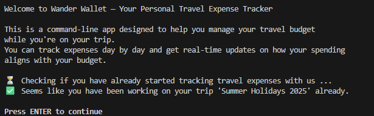
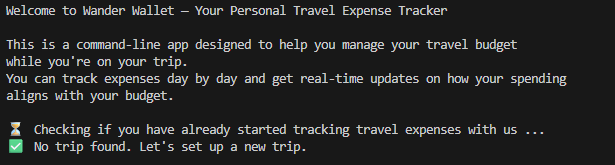
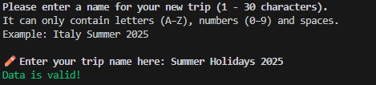
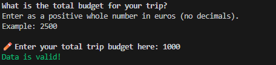
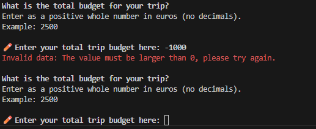
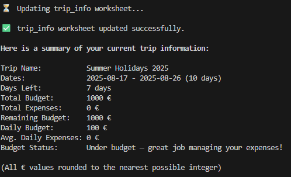
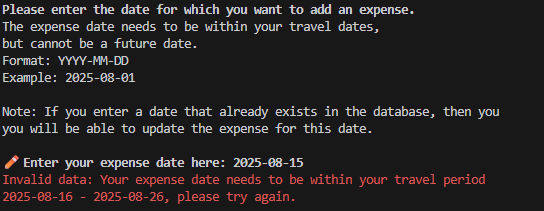
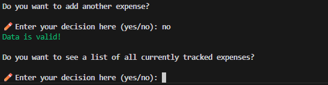
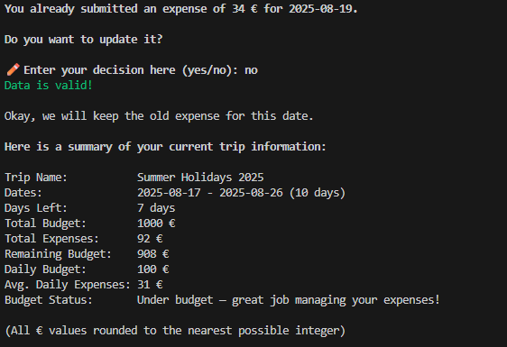

# Wander Wallet

“Wander Wallet” is a Python-based command-line application designed to help travelers track expenses and stay within budget while being on a trip. It is designed to give travelers a clear overview of their budget, tracked expenses and remaining funds while travelling. The application uses the Google Cloud API to connect to Google Sheets to store and update trip information and expenses. As a user, I want to easily add new expenses, view my current financial status and stay on track with my travel budget.

The website was created for educational purposes only.

[Live page on Heroku](https://wander-wallet-c4d586c6e78d.herokuapp.com/)


[](https://wander-wallet-c4d586c6e78d.herokuapp.com)


- - -

## User Experience (UX)

### Site Goals

- Business Goals: Provide a simple and reliable tool for managing travel budgets directly from the command line

- Users’ needs: Easily track trip expenses, stay on top of budgets and quickly understand whether they are spending within their limits

- Primary user: Travelers who want a simple way to manage their trip finances

### User Stories

#### Must-have

1. As a user, I want to easily understand the main purpose of the app

2. As a user, I want to be able to create a new trip with a budget and dates

3. As a user, I want to see a clear summary of my trip, including budget, expenses and whether I am over, under or on budget

4. As a user, I want to add new expenses with a date and amount

5. As a user, I want to update an expense if I entered something incorrectly

6. As a user, I want my data to be saved so that I can continue tracking expenses until the end of my trip

#### Should-have

7. As a user, I want feedback after adding or updating an expense so I know it worked

8. As a user, I want the app to handle errors gracefully so it doesn’t crash unexpectedly

#### Could-have

9. As a user, I want to track multiple trips at once

10. As a user, I want to categorize expenses (e.g. food, transport, accommodation)

11. As a user, I want to see charts of my spending for better insights

### Features to achieve the goals

- The application will have a simple, clear command-line interface so users immediately understand its purpose

- Users will be able to create a new trip by entering a trip name, budget and start/end dates

- Users will be able to add new expenses for specified dates

- Users will be able to update/correct an existing expense for a specific date

- Users will be able to view a clear summary of their trip, showing total budget, spent amount, remaining funds and whether they are over, under or on budget

- Users will be able to see a list of expenses

- The application will provide immediate feedback after adding or updating an expense to confirm the action succeeded

- Trip and expense data will be stored in Google Sheets to ensure persistence and accessibility across devices

- The app will handle errors gracefully to prevent crashes (e.g., invalid input)

- Users will be able to track multiple trips independently (could-have)

- Expenses can be categorized for better tracking and reporting (could-have)

- Users will be able to view charts or visual summaries of spending by category or over time (could-have)

- - -

## Design

### Flowchart

The following flowchart was created using [Lucidchart](https://lucid.app/) before starting to code, to visualize the intended general workflow of the application. During the development process, the workflow was adapted in certain areas to better fit technical requirements and improve user experience. While the flowchart represents the initial plan, some steps were modified or added in the final implementation.


### Color Scheme/Imagery/Typography
The application uses the [Python Essentials Template](https://github.com/Code-Institute-Org/python-essentials-template) provided by Code Institute. Although the application has a simple terminal-based interface with limited UI design, the following style choices were made to make user inputs, feedback, and overall interaction clear and easy to follow.

Bold text is used to highlight anything directly concerning the user, such as their inputs or headings in summaries. Green text is used to signal valid user inputs, while red text indicates errors, invalid inputs or warnings. All text styling has been implemented using [colorama](https://pypi.org/project/colorama/).

Emojis are used to indicate status messages and user inputs, helping to make the interface more engaging and easier to follow.

### Features

The application fulfills the must-have and should-have user stories.

#### Start Screen

When the application is launched, it displays a welcome message that introduces Wander Wallet and briefly explains its purpose. Immediately after, the app checks the database to see whether the user has already set up a trip.

If a trip exists, the user is shown a summary of their current trip, including budget, expenses and remaining funds.



If no trip is found, the user is informed about this and will be prompted to create a new trip in the next step.



#### Setting up a new trip

If no active trip is found, the user is guided through creating one. The setup process requires the user to provide a trip name, start and end dates and a total budget. Each input field includes specific restrictions to ensure valid data.

Trip Name:

- Trip name cannot be empty
- Can only contain letters (A–Z), numbers (0–9) and spaces
- 1-30 characters



Trip Dates: 

- Dates must be entered in the correct format and are validated to ensure they represent real calendar dates

- End date must lie in the future, preventing users from creating trips that have already ended


Trip Budget: 

- Budget must be entered in whole numbers and be a positive value



If the user enters invalid input, the app displays an error message explaining what went wrong and then shows the input field again, allowing the user to correct their input before proceeding. This ensures that every new trip is set up with complete and valid information before tracking begins.

Here is an example of an error message for a negative budget input.



When all trip information has been provided successfully, additional data such as the average daily budget is automatically calculated. The trip information is then saved to the connected Google Sheets worksheet and the user receives a status message confirming that the setup was successful. Finally, a summary of the current trip is displayed, giving the user a clear starting point for tracking their expenses.



After that, the user can either start adding expenses to their trip, or the program will end if the trip has not started yet. This prevents adding expenses that have not occurred yet. In this case, the user is informed that they can return to the app once the trip begins.

Trip has already started:


Trip has not started yet:


#### Working with an already existing trip

When, upon starting the app, a trip already exists in the database, the user is first shown a summary of their current trip, like described under [Start Screen](#start-screen).

Then the user can choose to show a list of all currently tracked expenses, by submitting a "yes" or "no" into the following input field.


After that, or when choosing "no" in the previous question, the user is asked if they want to continue working with this trip. 

If "yes", it is checked if the trip has already started or not, like after setting up a new trip. After that the user will be able to add expenses.


If "no", the current trip will be deleted and the process continues with setting up a new trip, like described above.


#### Adding expenses

After setting up a new trip or choosing to continue with the current one, the user is prompted to add a new expense. An expense consists of a date and an amount, each with specific restrictions to ensure valid data.

First the user is asked to enter an expense date:

- The date must be entered in the correct format and is validated to ensure it represents a real calendar date

- The date must fall within the travel period

- Future dates are not allowed, since expenses can only be recorded once they have occurred


Next, the user is asked to enter an expense amount:

- The amount must be entered in whole numbers and be a positive value


If the user enters invalid input for either field, the app displays an error message explaining what went wrong and then shows the input field again, allowing the user to correct their entry.

Example error message for invalid date input:



When both fields are entered successfully, the expense is saved to the connected Google Sheets worksheet. The user receives a status message confirming that the new expense has been added. Afterwards, the updated trip summary is shown.


#### Adding Multiple Expenses
After an expense has been successfully recorded, the user is asked whether they would like to add another one.

If the user chooses "yes", the process of entering a new expense (date and amount) begins again.


If the user chooses "no", the app proceeds by asking if the user wants to see a list of all tracked expenses.



This loop allows users to quickly add multiple expenses in one session, while also giving them the option to review their complete list of expenses before returning to the main summary.

#### Updating an Existing Expense

The user is also able to update an expense after it has already been submitted. For example, they may notice when reviewing the expense list at the beginning of the program that an amount was entered incorrectly, or that the cost for a specific date has changed.

In this case, the user can simply enter the same date again when prompted to add a new expense. The program automatically detects that an expense for this date already exists and notifies the user.

If the user chooses yes, they can enter a new amount, which will replace the previous one.


If the user chooses no, the app shows the current trip summary again, then continues to the next step and asks whether they want to add another expense.



This approach makes updating expenses a natural part of the normal expense entry flow.

#### End of the Program

Once the user decides not to add another expense, they are asked whether they would like to see the list of current expenses again.

If the user chooses yes, the full list of expenses is displayed before the program ends.


If the user chooses no, the program ends immediately.

When the program ends, the user is thanked for using Wander Wallet. A final summary of the trip is displayed, showing the budget, total expenses, remaining funds and whether the user is currently under or over budget.

Finally, the user is reminded that they can return to the app at any time to add more expenses to their trip or set up a new one.


#### Error Handling
Like mentioned above, all user inputs are validated, and clear messages are provided to inform the user about the expected format and type of input.

All input validation functions are organized in a dedicated validation.py file. There are four specific validation methods:

1. Expense date: Ensures the date is in the correct format, within the trip period and not in the future

2. Yes/No inputs: Checks whether the user correctly typed the words "yes" or "no" 

3. Integer inputs: Checks that numerical values are positive and valid

4. New trip information: Validates the trip name, dates and total budget according to the required restrictions

Additionally, a general error handling mechanism is implemented by wrapping the main function in a `try`/`except` block to catch any unexpected errors. Examples of such errors include connection issues with Google Sheets or file read/write problems. If such an error occurs, the application will restart automatically with the latest version of data that was successfully added to the database.


### Future Features

So far, the application includes all necessary features to create a minimum viable product. However, there is room for improvement and further functionality to enhance usability and flexibility for travelers:

- *Track multiple trips at once*  
Allow users to manage several trips in parallel instead of only focusing on a single active trip.

- *Expense categories*  
Add the option to assign categories such as food, transport, or accommodation to expenses, making it easier to analyze spending patterns.

- *Spending charts and visual insights*  
Provide visualizations (e.g. bar charts, line charts) to give users a clearer understanding of their budget usage and spending behavior.

- *Main menu navigation*  
Instead of being guided strictly through the workflow, offer a menu at the start of the program where the user can choose what they want to do (e.g. set up a new trip, add expenses, view expenses, update expenses or see a summary).

- *User accounts and login system*  
Implement a simple authentication system so multiple users can store and access their own trips independently. This would allow different travelers to use the app at the same time without interfering with each other’s data.

These features would significantly improve the overall user experience and make the application more powerful in supporting effective budget tracking.

## Testing

### Manual Testing

#### Scope

#### Results

### Code Validation

### User Story Testing

### Known Bugs 

- - -

## Technologies Used

### Languages Used

Python was used to create this application. 

All other code inside this project has been provided by the [Python Essentials Template](https://github.com/Code-Institute-Org/python-essentials-template) by Code Institute.

### Frameworks, Libraries & Programs Used

[Lucidchart](https://lucid.app/) - Used to create the flowchart

[Shields.io](https://shields.io/) - To add badges to the README

Chat GPT - Help debug, troubleshoot and explain things

Git - For version control

Github - To save and store the files for the website

Visual Studio Code - For local development

Google Cloud API - For access to Google services used by the app

- Google Sheets API - Handles all reading and writing of trip data and expenses to a connected Google Sheets document. This serves as the main database for the application

- Google Drive API - Manages access permissions and enables the application to locate and update the correct worksheet

Python libraries:
- colorama - To style the output displayed in the console
- datetime - To handle the "date" user inputs
- re - To handle trip name input
- time - To pause execution of code
- gspread - Access and update data in the Google Sheets spreadsheet
- google-auth - Set up the authentication needed to access the Google Cloud project

- - -

## Data Model

#### Classes & Functions

The program uses two classes as a blueprint for the project's object-oriented programming (OOP). This allows for the objects to be reusable and callable where necessary.

```python
class Trip:
    """
    Trip class
    """
    def __init__(self, trip_info: dict, expenses: dict):
        self.trip_info = trip_info
        self.expenses = expenses
        # Get trip info input fields (for calculations)
        self.trip_name = trip_info["trip_name"]
        self.start_date = datetime.strptime(
            trip_info["start_date"], "%Y-%m-%d"
            ).date()
        self.end_date = datetime.strptime(
            trip_info["end_date"], "%Y-%m-%d"
            ).date()
        self.total_budget = int(trip_info["total_budget"])
```
The `Trip` class is the core data model of the app, designed to store trip details and expenses while automatically calculating useful statistics like duration, daily budget, spending status and remaining balance. It also includes one of the main functions of the app that shows the trip summary to the user.

```python
class SheetManager:
    """
    Sheet Manager class
    """
    def __init__(self, creds_file: str, sheet_name: str):
        SCOPE = [
            "https://www.googleapis.com/auth/spreadsheets",
            "https://www.googleapis.com/auth/drive.file",
            "https://www.googleapis.com/auth/drive"
            ]
        CREDS = Credentials.from_service_account_file(creds_file)
        SCOPED_CREDS = CREDS.with_scopes(SCOPE)
        self.client = gspread.authorize(SCOPED_CREDS)
        self.sheet = self.client.open(sheet_name)
```
The `SheetManager` class handles all interactions with Google Sheets, making it easy to read, update and clear trip data from the connected spreadsheet. It separates storage logic from the main application, so the app can focus on budgeting features while this class reliably manages data access in the background.

The primary functions used on this application are:

- Validation functions in `validation.py`
    - Check validaity of all user inputs. See [Error Handling](#error-handling) for more details.
- `trip_exists()`
    - Check if trip exists already
- `get_new_trip_info()`
    - Get info for a new trip (start, end dates, trip name, budget)
- `continue_trip()`
    - Get input if the user wants to continue with the current trip or start a new one
- `start_new_trip()`
    - Initialize new trip
- `add_expenses()`
    - Get new expense entry as user input
- `get_new_expense()`
    -  Loop to handle asking the user to add another expense
- `show_expenses_summary()`
    - Check if user wants to see a list of all currently tracked expenses
- `main()`
    - Run all program functions.

#### Google Sheets

The application uses a Google Spreadsheet with two worksheets to store all trip-related data:

- `trip_info`: Stores the main trip details (trip name, dates and total budget) together with calculated values such as duration, days left, remaining budget and budget status.

- `expenses`: Stores all user-entered expenses with two columns: date and amount. 

Together, these worksheets ensure that both user input and automatically calculated data are saved, persistent and always up to date.
- - -

## Deployment & Local Development

### Deployment

todo: describe how to set up google sheets

Heroku was used to deploy the live application. The instructions to achieve this are below:

- Clone or fork this public repository
- Create a Heroku account (if not already existing)
- Create a new app with Heroku
- In **Settings**:
    - Add 2 buildpacks in the following order:
        1. `heroku/python`
        2. `heroku/nodejs`  

        Ensure the buildpacks are created in that order!
    - Create *Config Vars*:
        1. `PORT`: Set this to `8000`
        2. `CREDS`: Set this to your JSON

- Allow Heroku access to GitHub, link the new app to the relevant repository
- Choose whether or not to enable **Automatic Deploys**. If enabled, the deployed app will update automatically with each push to GitHub
- Click **Deploy**

Link to the deployed application: [https://wander-wallet-c4d586c6e78d.herokuapp.com/](https://wander-wallet-c4d586c6e78d.herokuapp.com/)

### Local Development

#### How to Fork

To fork the WanderWallet repository:

1. Log in (or sign up) to Github.
2. Go to the repository for this project, kathrinmzl/WanderWallet.
3. Click the Fork button in the top right corner.

#### How to Clone

To clone the WanderWallet repository:

1. Log in (or sign up) to GitHub.
2. Go to the repository for this project, kathrinmzl/WanderWallet.
3. Click on the code button, select whether you would like to clone with HTTPS, SSH or GitHub CLI and copy the link shown.
4. Open the terminal in your code editor and change the current working directory to the location you want to use for the cloned directory.
5. Type 'git clone' into the terminal and then paste the link you copied in step 3. Press enter.

- - -

## Credits

### Code Used

**Template and Terminal**: [Python Essentials Template](https://github.com/Code-Institute-Org/python-essentials-template) provided by Code Institute


### Content

The content for the application was written by myself. Some parts of this README were refined with the help of ChatGPT to improve clarity and phrasing.

