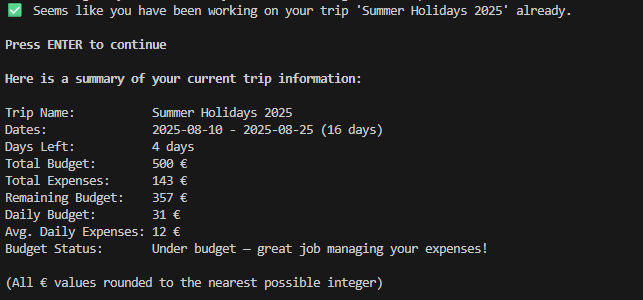
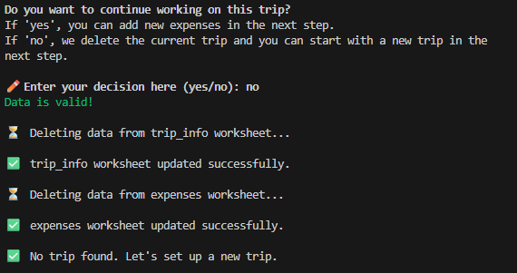
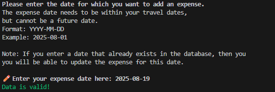
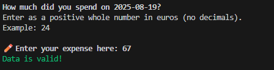
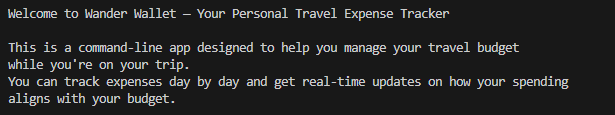

# Testing

> NOTE: Return back to the [README.md](README.md) file.

## Code Validation

I have used the recommended [PEP8 CI Python Linter](https://pep8ci.herokuapp.com) to validate all of my Python files.

Initially I had lines of code exceeding the recommended 79 characters, which I then restructured. Also there where some unnecessary whitespaces that I removed.

The final results are as follows:

| File | URL | Screenshot | Notes |
| --- | --- | --- | --- |
| [run.py](https://github.com/kathrinmzl/WanderWallet/blob/main/run.py) | [PEP8 CI Link](https://pep8ci.herokuapp.com/https://raw.githubusercontent.com/kathrinmzl/WanderWallet/main/run.py) |  | No errors found |
| [sheet_manager.py](https://github.com/kathrinmzl/WanderWallet/blob/main/sheet_manager.py) | [PEP8 CI Link](https://pep8ci.herokuapp.com/https://raw.githubusercontent.com/kathrinmzl/WanderWallet/main/sheet_manager.py) |  | No errors found |
| [trip.py](https://github.com/kathrinmzl/WanderWallet/blob/main/trip.py) | [PEP8 CI Link](https://pep8ci.herokuapp.com/https://raw.githubusercontent.com/kathrinmzl/WanderWallet/main/trip.py) |  | No errors found |
| [validation.py](https://github.com/kathrinmzl/WanderWallet/blob/main/validation.py) | [PEP8 CI Link](https://pep8ci.herokuapp.com/https://raw.githubusercontent.com/kathrinmzl/WanderWallet/main/validation.py) |  | No errors found |

## Defensive Programming

Defensive programming was manually tested with the below user acceptance testing:

| Feature | Expectation | Test | Result | Screenshot |
| --- | --- | --- | --- | --- |
| Check if trip already exists |  Upon launching the application, inform the user whether they have already set up a trip. | Open application with an empty database | User is informed that no trip has been found |  |
| |  | Open application with an exisiting database | User is informed that a trip has been found and is shown a summary of their current trip|  |
| Set up a new trip |  The user can only provide a valid trip name | Input an empty trip name | Error message is shown and user can make a new input|  |
| | | Input a trip name that is not only letters (A–Z), numbers (0–9) and spaces | Error message is shown and user can make a new input|  |
| | | Input a trip name that is not 1-30 characters | Error message is shown and user can make a new input|  |
| | | Input a valid trip name | Valid data message is shown |  |
| |  The user can only provide valid trip dates | Input empty trip dates | Error message is shown and user can make a new input|  |
| | | Input trip dates that does not have the format YYYY-MM-DD| Error message is shown and user can make a new input|  |
| | | Input a trip end date that is not in the future | Error message is shown and user can make a new input|  |
| | | Input a trip end date that before the start date | Error message is shown and user can make a new input|  |
| | | Input trip dates not seperated by a comma | Error message is shown and user can make a new input|  |
| | | Input valid trip dates | Valid data message is shown |  |
| |  The user can only provide a valid trip budget | Input empty trip budget | Error message is shown and user can make a new input|  |
| | | Input negative trip budget | Error message is shown and user can make a new input|  |
| | | Input symbols that aren't whole numbers | Error message is shown and user can make a new input|  |
| | | Input a valid trip budget | Valid data message is shown |  |
| Yes/No question inputs |  The user can only provide a valid input | Input an empty string | Error message is shown and user can make a new input|  |
| | | Input anything but "yes" or "no" | Error message is shown and user can make a new input|  |
| | | Input "yes" or "no" in capital or small letters |  Valid data message is shown |  |
| Show a trip summary |  All values are correctly calculated from the trip info and expenses user input | Verify the trip summary values after setting up a new trip | All values are calculated correctly|  |
| | | Verify the trip summary values after adding expenses | All values are calculated correctly|  |
| | | Verify the trip summary values when opening the app with an existing trip | All values are calculated correctly|  |
| Show expenses list |  All values are correctly displayed and chronologically ordered | Verify the expense list when opening the app with an existing trip| All values are shown correctly|  |
| | | Verify the expense list after adding expenses | All values are shown correctly|  |
| Continue trip |  Delete trip data if user does not want to continue working with the current trip | Input "no"| The user can set up a new trip|  |
| | Continue to add expenses if user wants to continue working with the trip | Input "yes"| The user is able to add expenses|  |
| Add expense |  The user can only provide a valid expense date | Input an empty trip date| Error message is shown and user can make a new input|  |
| | | Input a date that does not have the format YYYY-MM-DD| Error message is shown and user can make a new input|  |
| | | Input a date that is not within the travel period | Error message is shown and user can make a new input|  |
| | | Input a date that is a future date | Error message is shown and user can make a new input|  |
| | | Input a valid date | Valid data message is shown |  |
| |  The user can only provide a valid expense amount| Input an empty amount| Error message is shown and user can make a new input|  |
| | | Input a negative amount | Error message is shown and user can make a new input|  |
| | | Input symbols that aren't whole numbers | Error message is shown and user can make a new input|  |
| | | Input a valid amount | Valid data message is shown |  |
| Add another expense |  If the user chooses "yes", the process of entering a new expense begins again | Input "yes"| The user can add another expense |  |
| | If the user chooses "no", the app proceeds| Input "no"| The app proceeds to the next step|  |
| Update an expense |  If the user enters an already exisiting expense date, they are prompted to decide whether to update it or not | Input "yes"| The expense gets updated |  |
| | | Input "no"| The expense does not get updated |  |
| End of program |  When the user decides not to add any more expenses, they are given the opportunity to show a list of expenses and the trip summary | Don't add another expense| The program gives the option to show the expense list and then ends the program with the final trip summary |   |

## User Story Testing

| Target | Expectation | Outcome | Screenshot |
| --- | --- | --- | --- |
| As a user | I want to easily understand the main purpose of the app | so I know right away how it helps me. |  |
| As a user | I want to be able to create a new trip with a budget and dates | so I can set the financial framework for my travels. |  |
| As a user | I want to see a clear summary of my trip, including budget, expenses and whether I am over, under or on budget | so I always know my financial status. |  |
| As a user | I want to add new expenses with a date and amount | so I can keep an accurate record of my spending. |  |
| As a user | I want to update an expense if I entered something incorrectly | so my data stays accurate. |  |
| As a user | I want my data to be saved so that I can continue tracking expenses until the end of my trip | so I don’t lose progress during the journey.|  |
| As a user | I want feedback after adding or updating an expense| so I know my action was successful. |  |
| As a user |  I want the app to handle errors gracefully so it doesn’t crash unexpectedly | so I can keep using it without interruptions. |  |

## Bugs

All bug fixing activities were documented in the Git commit history using the keyword `fix: ...` for clarity and traceability. 

To this date, no known unfixed errors remain in the application, though, even after thorough testing, I cannot rule out the possibility.

### Known Issues

| Issue | Screenshot |
| --- | --- |
| If a user types `CTRL`+`C` in the terminal on the live site, they can manually stop the application and receive an error. |  |

