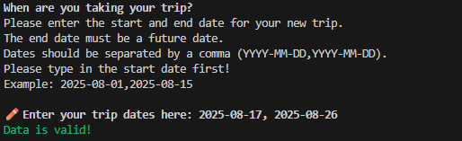
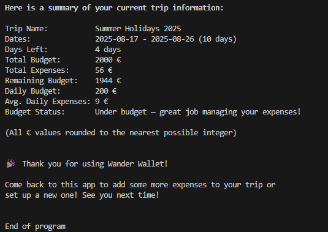
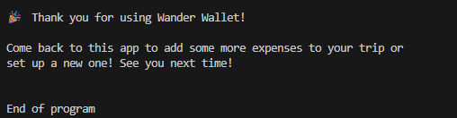

# Testing

> NOTE: For all testing, please refer to the [TESTING.md](TESTING.md) file.

## Manual Testing

### Scope

### Results

## Code Validation

## User Story Testing

## Known Bugs 

# Testing

> NOTE: Return back to the [README.md](README.md) file.

## Code Validation

I have used the recommended [PEP8 CI Python Linter](https://pep8ci.herokuapp.com) to validate all of my Python files.

TODO: Clear linter warnings, add screenshots, any notes? if not, remove

| File | URL | Screenshot | Notes |
| --- | --- | --- | --- |
| [run.py](https://github.com/kathrinmzl/WanderWallet/blob/main/run.py) | [PEP8 CI Link](https://pep8ci.herokuapp.com/https://raw.githubusercontent.com/kathrinmzl/WanderWallet/main/run.py) |  | ⚠️ Notes (if applicable) |
| [sheet_manager.py](https://github.com/kathrinmzl/WanderWallet/blob/main/sheet_manager.py) | [PEP8 CI Link](https://pep8ci.herokuapp.com/https://raw.githubusercontent.com/kathrinmzl/WanderWallet/main/sheet_manager.py) |  | ⚠️ Notes (if applicable) |
| [trip.py](https://github.com/kathrinmzl/WanderWallet/blob/main/trip.py) | [PEP8 CI Link](https://pep8ci.herokuapp.com/https://raw.githubusercontent.com/kathrinmzl/WanderWallet/main/trip.py) |  | ⚠️ Notes (if applicable) |
| [validation.py](https://github.com/kathrinmzl/WanderWallet/blob/main/validation.py) | [PEP8 CI Link](https://pep8ci.herokuapp.com/https://raw.githubusercontent.com/kathrinmzl/WanderWallet/main/validation.py) |  | ⚠️ Notes (if applicable) |

## Responsiveness

TODO: Check in the end if time is still there, otherwise delete section

I've tested my deployed project to check for responsiveness issues.

| Mobile | Tablet | Desktop | Notes |
| --- | --- | --- | --- |
|  |  |  | Mobile issues: `overflow-x`, doesn't work on iPhones, but does work on Android with some limitations |

## Browser Compatibility

TODO: Check in the end if time is still there, otherwise delete section

I've tested my deployed project on multiple browsers to check for compatibility issues.

| Chrome | Firefox | Safari | Notes |
| --- | --- | --- | --- |
|  |  |  | Chrome: work as expected. Firefox: emojis get cut-off. Safari: some limitations. |

## Defensive Programming

⚠️ INSTRUCTIONS ⚠️

Defensive programming (defensive design) is extremely important! When building projects that accept user inputs or forms, you should always test the level of security for each form field. Examples of this could include (but not limited to):

All Projects:

- Users cannot submit an empty form (add the `required` attribute)
- Users must enter valid field types (ensure the correct input `type=""` is used)
- Users cannot brute-force a URL to navigate to a restricted pages

Python Projects:

- Users cannot perform CRUD functionality if not authenticated (if login functionality exists)
- User-A should not be able to manipulate data belonging to User-B, or vice versa
- Non-Authenticated users should not be able to access pages that require authentication
- Standard users should not be able to access pages intended for superusers/admins

You'll want to test all functionality on your application, whether it's a standard form, or CRUD functionality, for data manipulation on a database. Try to access various pages on your site as different user types (User-A, User-B, guest user, admin, superuser). You should include any manual tests performed, and the expected results/outcome.

Testing should be replicable (can someone else replicate the same outcome?). Ideally, tests cases should focus on each individual section of every page on the website. Each test case should be specific, objective, and step-wise replicable.

Instead of adding a general overview saying that everything works fine, consider documenting tests on each element of the page (eg. button clicks, input box validation, navigation links, etc.) by testing them in their "happy flow", their "bad/exception flow", mentioning the expected and observed results, and drawing a parallel between them where applicable.

Consider using the following format for manual test cases:

- Expected Outcome / Test Performed / Result Received / Fixes Implemented

- **Expected**: "Feature is expected to do X when the user does Y."
- **Testing**: "Tested the feature by doing Y."
- (either) **Result**: "The feature behaved as expected, and it did Y."
- (or) **Result**: "The feature did not respond to A, B, or C."
- **Fix**: "I did Z to the code because something was missing."

Use the table below as a basic start, and expand on it using the logic above.

⚠️ --- END --- ⚠️

Defensive programming was manually tested with the below user acceptance testing:

| Feature | Expectation | Test | Result | Screenshot |
| --- | --- | --- | --- | --- |
| Check if trip already exists |  Upon launching the application, inform the user whether they have already set up a trip. | Open application with an empty database | User is informed that no trip has been found |  |
| |  | Open application with an exisiting database | User is informed that a trip has been found and is shown a summary of their current trip|  |
| Set up a new trip |  The user can only provide a valid trip name | Input an empty trip name | Error message is shown and user can make a new input|  |
| | | Input a trip name that is not only letters (A–Z), numbers (0–9) and spaces | Error message is shown and user can make a new input|  |
| | | Input a trip name that is not 1-30 characters | Error message is shown and user can make a new input|  |
| | | Input a valid trip name | Valid data message is shown |  |
| |  The user can only provide valid trip dates | Input empty trip dates | Error message is shown and user can make a new input|  |
| | | Input trip dates that does not have the format YYYY-MM-DD| Error message is shown and user can make a new input|  |
| | | Input a trip end date that is not in the future | Error message is shown and user can make a new input|  |
| | | Input a trip end date that before the start date | Error message is shown and user can make a new input|  |
| | | Input trip dates not seperated by a comma | Error message is shown and user can make a new input|  |
| | | Input valid trip dates | Valid data message is shown |  |
| |  The user can only provide a valid trip budget | Input empty trip budget | Error message is shown and user can make a new input|  |
| | | Input negative trip budget | Error message is shown and user can make a new input|  |
| | | Input symbols that aren't whole numbers | Error message is shown and user can make a new input|  |
| | | Input a valid trip budget | Valid data message is shown |  |
| Yes/No question inputs |  The user can only provide a valid input | Input an empty string | Error message is shown and user can make a new input|  |
| | | Input anything but "yes" or "no" | Error message is shown and user can make a new input|  |
| | | Input "yes" or "no" in capital or small letters |  Valid data message is shown |  |
| Show a trip summary |  All values are correctly calculated from the trip info and expenses user input | Verify the trip summary values after setting up a new trip | All values are calculated correctly|  |
| | | Verify the trip summary values after adding expenses | All values are calculated correctly|  |
| | | Verify the trip summary values when opening the app with an existing trip | All values are calculated correctly|  |
| Show expenses list |  All values are correctly displayed and chronologically ordered | Verify the expense list when opening the app with an existing trip| All values are shown correctly|  |
| | | Verify the expense list after adding expenses | All values are shown correctly|  |
| Continue trip |  Delete trip data if user does not want to continue working with the current trip | Input "no"| The user can set up a new trip|  |
| | Continue to add expenses if user wants to continue working with the trip | Input "yes"| The user is able to add expenses|  |
| Add expense |  The user can only provide a valid expense date | Input an empty trip date| Error message is shown and user can make a new input|  |
| | | Input a date that does not have the format YYYY-MM-DD| Error message is shown and user can make a new input|  |
| | | Input a date that is not within the travel period | Error message is shown and user can make a new input|  |
| | | Input a date that is a future date | Error message is shown and user can make a new input|  |
| | | Input a valid date | Valid data message is shown |  |
| |  The user can only provide a valid expense amount| Input an empty amount| Error message is shown and user can make a new input|  |
| | | Input a negative amount | Error message is shown and user can make a new input|  |
| | | Input symbols that aren't whole numbers | Error message is shown and user can make a new input|  |
| | | Input a valid amount | Valid data message is shown |  |
| Add another expense |  If the user chooses "yes", the process of entering a new expense begins again | Input "yes"| The user can add another expense |  |
| | If the user chooses "no", the app proceeds| Input "no"| The app proceeds to the next step|  |
| Update an expense |  If the user enters an already exisiting expense date, they are prompted to decide whether to update it or not | Input "yes"| The expense gets updated |  |
| | | Input "no"| The expense does not get updated |  |
| End of program |  When the user decides not to add any more expenses, they are given the opportunity to show a list of expenses and the trip summary | Don't add another expense| The program gives the option to show the expense list and then ends the program with the final trip summary |   |

## User Story Testing

| Target | Expectation | Outcome | Screenshot |
| --- | --- | --- | --- |
| As a user | I want to easily understand the main purpose of the app | so I know right away how it helps me. |  |
| As a user | I want to be able to create a new trip with a budget and dates | so I can set the financial framework for my travels. |  |
| As a user | I want to see a clear summary of my trip, including budget, expenses and whether I am over, under or on budget | so I always know my financial status. |  |
| As a user | I want to add new expenses with a date and amount | so I can keep an accurate record of my spending. |  |
| As a user | I want to update an expense if I entered something incorrectly | so my data stays accurate. |  |
| As a user | I want my data to be saved so that I can continue tracking expenses until the end of my trip | so I don’t lose progress during the journey.|  |
| As a user | I want feedback after adding or updating an expense| so I know my action was successful. |  |
| As a user |  I want the app to handle errors gracefully so it doesn’t crash unexpectedly | so I can keep using it without interruptions. |  |

## Bugs

⚠️ INSTRUCTIONS ⚠️

Nobody likes bugs,... except the assessors! Projects seem more suspicious if a student doesn't properly track their bugs. If you're about to submit your project without any bugs listed below, you should ask yourself why you're doing this course in the first place, if you're able to build this entire application without running into any bugs. The best thing you can do for any project is to document your bugs! Not only does it show the true stages of development, but think of it as breadcrumbs for yourself in the future, should you encounter the same/similar bug again, it acts as a gentle reminder on what you did to fix the bug.

If/when you encounter bugs during the development stages of your project, you should document them here, ideally with a screenshot explaining what the issue was, and what you did to fix the bug.

Alternatively, an improved way to manage bugs is to use the built-in **[Issues](https://www.github.com/kathrinmzl/WanderWallet/issues)** tracker on your GitHub repository. This can be found at the top of your repository, the tab called "Issues".

If using the Issues tracker for bug management, you can simplify the documentation process for testing. Issues allow you to directly paste screenshots into the issue page without having to first save the screenshot locally. You can add labels to your issues (e.g. `bug`), assign yourself as the owner, and add comments/updates as you progress with fixing the issue(s). Once you've solved the issue/bug, you should then "Close" it.

When showcasing your bug tracking for assessment, you can use the following examples below.

⚠️ --- END --- ⚠️

### Fixed Bugs

I've used [GitHub Issues](https://www.github.com/kathrinmzl/WanderWallet/issues) to track and manage bugs and issues during the development stages of my project.

All previously closed/fixed bugs can be tracked [here](https://www.github.com/kathrinmzl/WanderWallet/issues?q=is%3Aissue+is%3Aclosed+label%3Abug).

### Unfixed Bugs

⚠️ INSTRUCTIONS ⚠️

You will need to mention any unfixed bugs and why they are not fixed upon submission of your project. This section should include shortcomings of the frameworks or technologies used. Although time can be a big variable to consider, paucity of time and difficulty understanding implementation is not a valid reason to leave bugs unfixed. Where possible, you must fix all outstanding bugs, unless outside of your control.

If you've identified any unfixed bugs, no matter how small, be sure to list them here! It's better to be honest and list them, because if it's not documented and an assessor finds the issue, they need to know whether or not you're aware of them as well, and why you've not corrected/fixed them.

⚠️ --- END --- ⚠️

Any remaining open issues can be tracked [here](https://www.github.com/kathrinmzl/WanderWallet/issues?q=is%3Aissue+is%3Aopen+label%3Abug).

### Known Issues

| Issue | Screenshot |
| --- | --- |
| When using a helper `clear()` function, any text above the height of the terminal (24 lines) does not clear, and remains when scrolling up. |  |
| The `colorama` terminal colors are fainter on Heroku when compared to the IDE locally. |  |
| Emojis are cut-off when viewing the application from Firefox. |  |
| The Python terminal doesn't work well with Safari, and sometimes uses cannot type in the application. |  |
| If a user types `CTRL`+`C` in the terminal on the live site, they can manually stop the application and receive and error. |  |

> [!IMPORTANT]  
> There are no remaining bugs that I am aware of, though, even after thorough testing, I cannot rule out the possibility.

